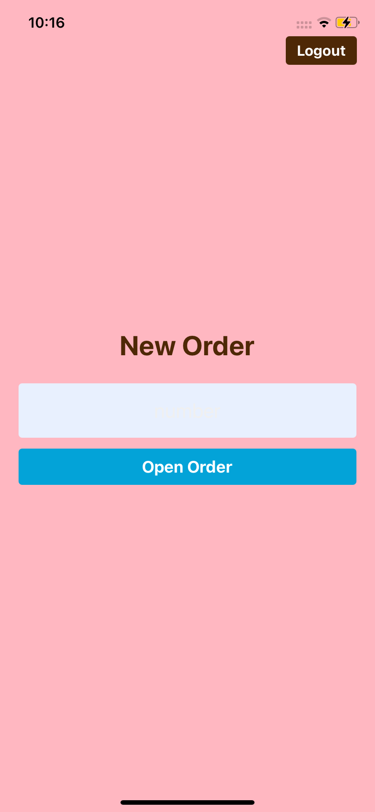
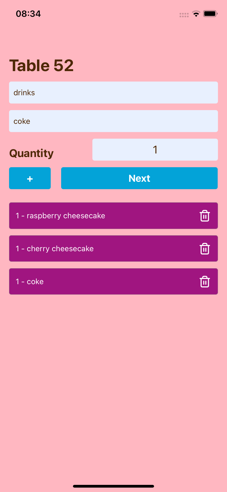

# 📱 Sweetland - mobile

A simple React Native mobile app that allows waiters to take customer orders and send them directly to the kitchen. Built with [Expo](https://expo.dev/), this app is part of a full system integrated with a [web version](https://github.com/grc-softdev/sweetland-client/tree/main) for management.

## 📱 Features

- 🔐 **Login**: Waiters log in to access the system.
- 📋 **Dashboard**: Enter the table number to start a new order.
- 🧾 **Product Selection**: Choose products grouped by categories.
- 📤 **Send to Kitchen**: Finalize the order and send it to the kitchen system.
- 🔄 **Sync with Desktop App**: Products and categories are registered via the desktop version and consumed by the mobile app.

## 🧪 How It Works

1. **Login screen**
   <p>
    
   </p>

2. **Enter table number**
    <p>
    
   </p>

3. **Select products by category**
    <p>
    
   </p>

 **Send order to kitchen**  
   - Once confirmed, the selected items and table number are sent to the kitchen system (visible in the desktop version).

## 📦 Setup & Running

### Prerequisites

- Node.js
- Expo CLI (`npm install -g expo-cli`)

### Installation

```bash
git clone https://github.com/your-username/sweetland-mobile.git

npm install

npx expo start
```

⚠️ Note: Ensure the backend server is running and accessible.

🧾 License
This project is licensed under the MIT License.

